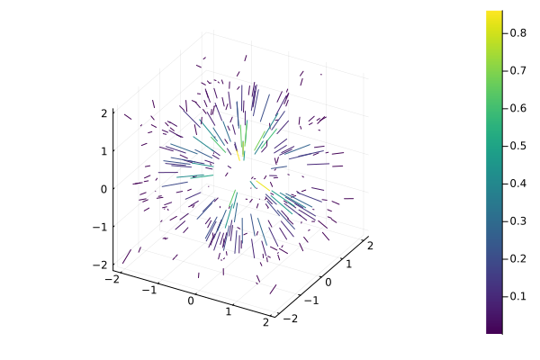
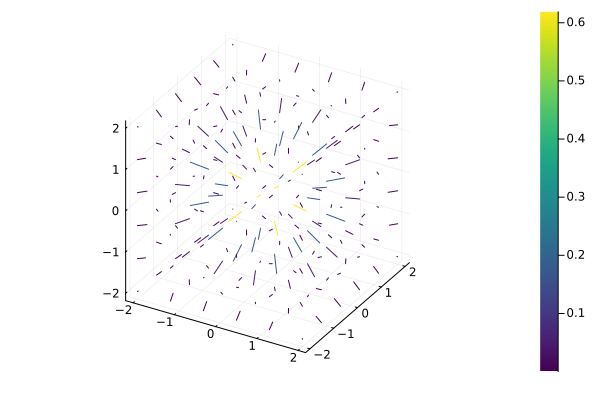

# Example 3

```@example 3
using CoupledFields
using CoupledFields: ndgrid

function gauss3d(X::AbstractMatrix)
    r = sum(abs2, X, dims=2)
    return exp.(-r)
end

function gauss3d(X::Tuple)
    r = reduce(+, [x.^2 for x in X])
    return exp.(-r)
end
```


```@example 3
# Irregular points in a cube
X = 4.0.*rand(300,3).-2
Y = gauss3d(X)
∇g = 1.2*gradient(X, Y[:,1:1])
size(∇g)
```

```julia
# using Plots
quiver(eachcol(X)..., quiver=(∇g[:,1],∇g[:,2],∇g[:,3]), line_z=repeat(vec(Y), inner=4), 
  c=:viridis)
```




```@example 3
# Regular points in a cube
i = range(-2, 2, 6)
X2 = ndgrid(i, i, i)
Z = gauss3d(X2)
# if Z is an array, use `axs` for point range per dimension 
∇g = gradient(Z, axs=(i,i,i))
size(∇g)
```

```julia
X3 = reduce(hcat, vec.(X2))
quiver(eachcol(X3)..., quiver=(∇g[:,1],∇g[:,2],∇g[:,3]), line_z=repeat(vec(Z), inner=4),
  c=:viridis) 
```


